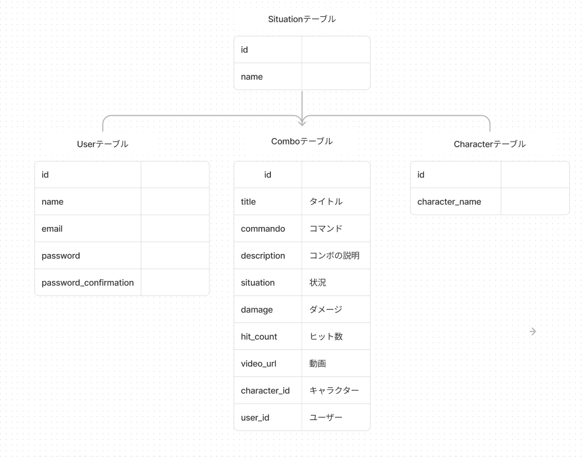

# UNI COMBO

[UNI COMBO](https://unicombohub.com/) はアンダーナイトインヴァース（通称　 UNI）という格闘ゲームのコンボ動画を共有するための Web アプリケーションです。ユーザーが自分のコンボ動画をアップロードし、他のユーザーはそれを見て新しいコンボを練習することができます。

URL: https://unicombohub.com/

# 機能

- 動画の投稿

- 投稿された動画を探しやすくするためのフィルター機能

- 投稿の評価機能(いいね機能)

- 投稿時のコマンド入力の簡易化(入力したい内容をボタンを押すことで入力し、長いコンボでも簡単に投稿できるように)

- 動画のループ、スピード変更（コンボを練習しやすいように動画をスローにしたり、ループすることができます。)

# 使用技術

- Ruby: 2.7
- Rails: 7
- Bootstrap
- DB: SQLite(開発環境)、Postgresql(本番環境)
- デプロイ: [Render.com](https://render.com/)
- 動画保存: AWS S3
- メール機能: AWS SES
- ドメイン管理: AWS Route 53

# ER図

# 開発の経緯

このゲームは私が中学生の頃から大好きなゲームです。このゲームの最大の特徴はコンボの長さです。また、それに比例してコンボの難易度や自由度も高いです。youtube を見ると上手い方々が独自のコンボをいくつも投稿しています。私はそこでかっこよかったり難しいコンボの練習をするのが大好きなのですが、youtube だと探したいコンボを都合よく見つけることが難しいためこのアプリケーションを作りました。このアプリケーションではダメージやヒット数などでコンボをソートしたり出来るフィルター機能で練習したいコンボを探しやすくなっています。
